## Multivariate normal hierarchical models

A number of different data sets will be explored.
1. One population with a normal distribution, different-sized samples

Modelling data.

We will randomise some data for our first example using the rnorm() function,
which draws random samples from a normal distribution with 'location' (mean) and
'scale' (sd = standard deviation). Note that we need many draws to be able to 
observe the normal distribution visually.


```r
data <- rbind(data.frame(group = 'V', value = rnorm(5, 0, 1)),
              data.frame(group = 'X', value = rnorm(10, 0, 1)),
              data.frame(group = 'L', value = rnorm(50, 0, 1)),
              data.frame(group = 'C', value = rnorm(100, 0, 1))
              )
    
data$group <- factor(x = data$group,
                    levels = c('V', 'X', 'L', 'C')
                    )

# Plot as histograms
ggplot(data = data,
       mapping = aes(x = value)
       ) +
    facet_wrap(~ group,
               scales = 'free') +
    geom_histogram() +
    theme_bw()
```

```
## `stat_bin()` using `bins = 30`. Pick better value with `binwidth`.
```

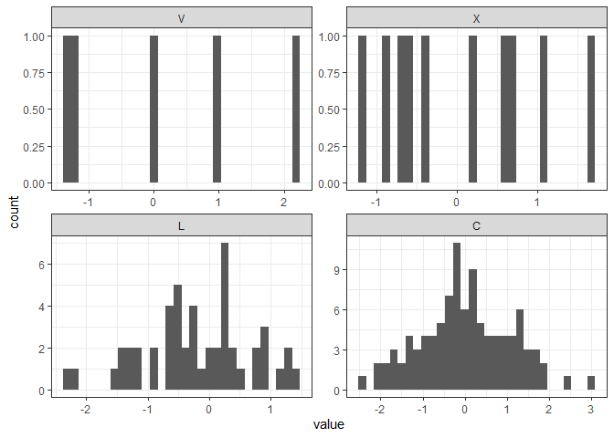<!-- -->

```r
# Plotting as densities, with the true probability density in red
ggplot(data = data,
       mapping = aes(x = value)
       ) +
    facet_wrap(~ group,
               scales = 'free') +
    geom_density() +
    geom_function(fun = dnorm,
                  colour = "red",
                  linetype = 'dashed') +
    theme_bw()
```

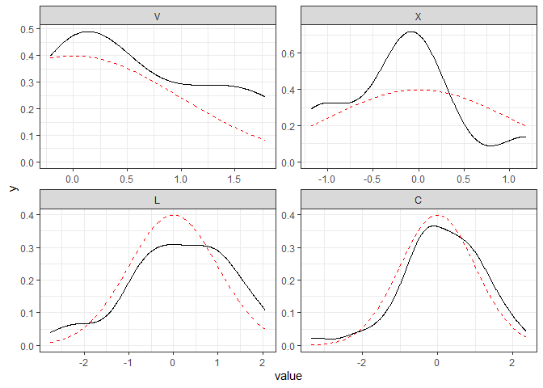<!-- -->


```r
# We can ask Stan to find the parameters of any or all of those
normal_data_for_stan <- list(n_y = dim(data)[1],
                             n_groups = length(unique(data$group)),
                             group = match(data$group, unique(data$group)),
                             y = data$value)

fit_normal <- rstan::stan(file = 'stan scripts/normal_distribution.stan',
                          model_name = 'normal distribution',
                          data = normal_data_for_stan,
                          chains = 4,
                          cores = 4,
                          iter = 4000,
                          warmup = 2000,
                          control = list(adapt_delta = 0.99)
                          ) 

# Inspect the trace plots - we want them to look like 'hairy caterpillars''
# https://druedin.com/2016/12/26/that-hairy-caterpillar/
rstan::traceplot(fit_normal)
```

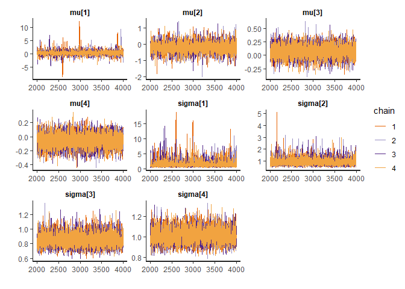<!-- -->

```r
# Create summary object and print out the overall summary (a.k.a. summary$summary)
summary <- rstan::summary(fit_normal,
                     probs = c(0.025, 0.5, 0.975)
                     )

# We want all the Rhats to be less than 1.01, and we need n_eff to be >100 but
# ideally in the thousands
round(summary$summary, 2)
```

```
##            mean se_mean   sd    2.5%    50%  97.5%   n_eff Rhat
## mu[1]      0.64    0.02 0.86   -1.18   0.64   2.39 2909.05    1
## mu[2]     -0.19    0.00 0.28   -0.75  -0.19   0.38 4353.33    1
## mu[3]      0.14    0.00 0.17   -0.19   0.14   0.47 7538.03    1
## mu[4]      0.11    0.00 0.11   -0.10   0.11   0.33 7327.67    1
## sigma[1]   1.66    0.02 1.16    0.59   1.30   4.92 2711.36    1
## sigma[2]   0.86    0.00 0.28    0.51   0.81   1.59 3669.95    1
## sigma[3]   1.18    0.00 0.12    0.96   1.17   1.45 7313.34    1
## sigma[4]   1.10    0.00 0.08    0.96   1.10   1.27 8238.32    1
## lp__     -95.26    0.04 2.16 -100.22 -94.94 -92.03 2798.47    1
```

```r
# Extract the posterior distributions from the fit
par <- rstan::extract(fit_normal)

# Save all samples from the posterior into a data frame
df <- data.frame(
    iter = length(par$mu[, 1]),
    V_mu = par$mu[, 1],
    X_mu = par$mu[, 2],
    L_mu = par$mu[, 3],
    C_mu = par$mu[, 4],
    V_sigma = par$sigma[, 1],
    X_sigma = par$sigma[, 2],
    L_sigma = par$sigma[, 3],
    C_sigma = par$sigma[, 4]
    )

# Re-format for easy graphing
df_long <- pivot_longer(data = df,
                        cols = !iter,
                        names_to = 'parameter',
                        values_to = 'sample')

par_names <- c('V_mu', 'X_mu', 'L_mu', 'C_mu',
               'V_sigma', 'X_sigma', 'L_sigma', 'C_sigma')

# Make the parameter column a factor for easier data handling and graphing
df_long$parameter <- factor(x = df_long$parameter,
                            levels = par_names
                            )

# Plot the probability densities with vertical lines (geom_vline) at 'real' value
ggplot(data = df_long,
       mapping = aes(x = sample)
       ) +
    facet_wrap(~ parameter,
               scales = 'free',
               ncol = 4) +
    geom_density() +
    geom_vline(data = data.frame(parameter = factor(par_names, levels = par_names),
                          xintercept = c(0, 0, 0, 0, 1, 1, 1, 1)
                          ),
               aes(xintercept = xintercept),
               colour = 'red',
               linetype = 'dashed') +
    theme_bw()
```

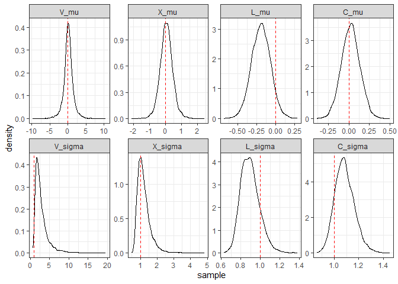<!-- -->

If we sample from two different values with appropriate distributions, we can use
the values to simulate data from a linear relationship, y = alpha + beta*x


```r
# samples to draw from each distribution
N <- 10

true_linear <- data.frame(
        subj_id = 1:N,
        alpha = rnorm(N, 10, 2),
        beta = rnorm(N, 1, 0.5)
        )

true_linear_long <- true_linear %>%
    pivot_longer(cols = !subj_id,
                 names_to = 'parameter',
                 values_to = 'value')

true_linear_long$parameter <- factor(x = true_linear_long$parameter,
                              levels = c('alpha', 'beta')
                              )

# Set up a function to get from the parameters to the simulated data
linear <- function(alpha, beta, x) {
    y = alpha + beta * x

    return(y)
}

# Plot the histograms
ggplot(data = true_linear_long,
       mapping = aes(x = value)
       ) +
    facet_wrap(~ parameter,
               scales = 'free') +
    geom_histogram() +
    theme_bw()
```

```
## `stat_bin()` using `bins = 30`. Pick better value with `binwidth`.
```

<!-- -->

```r
# Set up a palette
my_palette <- viridis::viridis(n = N)

# Set up canvas
plot <- ggplot() +
        xlim(-10, 10) +
        theme_bw()

# Add the individual curves    
for (n in 1:N) {
    plot <- plot +
    geom_function(fun = linear,
                  args = list(alpha = true_linear$alpha[n],
                              beta = true_linear$beta[n]
                              ),
                  colour = my_palette[n]
                  )        
}

plot
```

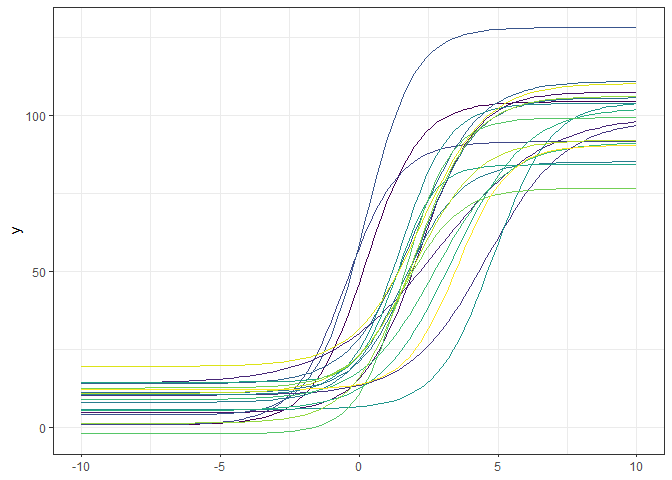<!-- -->

Any true data will also come with measurement noise etc., so we will add a extra layer. 


```r
# We now know how to draw perfect data - but we want noisy data!
# Let's add some noise and collect data in duplicates at various x values

n_rep <- 2
x_series <- seq(from = -10, to = 10, by = 5)

# Set up a data frame with the data for the linear association
normal_data <- data.frame(
    subj_id = gl(n = N, k = n_rep * length(x_series)),
    rep = rep(x = 1:n_rep,
              times = N * length(x_series)),
    x = rep(x = sort(rep(x_series, n_rep)),
            times = N),
    y = NA
)

# In this (simplistic) case we will have a common noise level on all data
sd_y <- 10

normal_data$y <- linear(alpha = true_linear$alpha[normal_data$subj_id],
                        beta = true_linear$beta[normal_data$subj_id],
                        x = normal_data$x) +
                 rnorm(n = length(normal_data$y),
                       mean = 0,
                       sd = sd_y)

# Example plots (the filter makes sure we only plot up to 4 subjects)
ggplot(data = filter(normal_data, subj_id %in% c(1:4)),
       mapping = aes(x = x,
                     y = y,
                     colour = subj_id)) +
    geom_jitter(width = 0.1) +
    geom_smooth(method = 'lm') +
    theme_bw()
```

```
## `geom_smooth()` using formula = 'y ~ x'
```

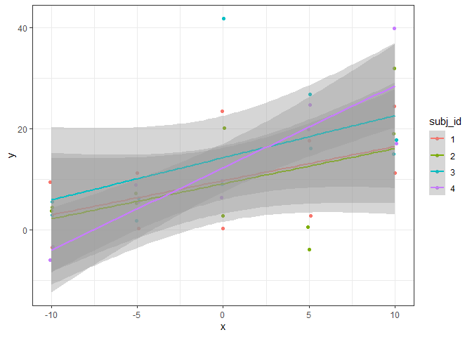<!-- -->


```r
# ... and we can now ask Stan to try to estimate the starting parameters!
# 

# We can ask Stan to find the parameters of any or all of those
linear_data_for_stan <- list(n_y = dim(normal_data)[1],
                             n_subj = length(unique(normal_data$subj_id)),
                             subj_id = as.integer(normal_data$subj_id),
                             x = normal_data$x,
                             y = normal_data$y)

# Note to self: the standard deviations are not informed by the data so should
# be removed from this, the simplest model!

fit_linear <- rstan::stan(file = 'stan scripts/linear.stan',
                          model_name = 'linear',
                          data = linear_data_for_stan,
                          chains = 4,
                          cores = 4,
                          iter = 4000,
                          warmup = 2000,
                          control = list(adapt_delta = 0.99)
                          ) 

# Inspect the trace plots - we want them to look like 'hairy caterpillars''
# https://druedin.com/2016/12/26/that-hairy-caterpillar/
rstan::traceplot(fit_linear)
```

```
## 'pars' not specified. Showing first 10 parameters by default.
```

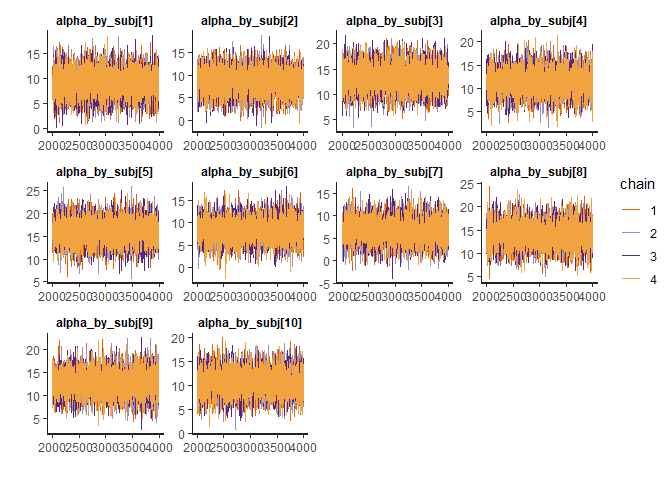<!-- -->

```r
# Create summary object and print out the overall summary (a.k.a. summary$summary)
summary <- rstan::summary(fit_linear,
                     probs = c(0.025, 0.5, 0.975)
                     )

# We want all the Rhats to be less than 1.01, and we need n_eff to be >100 but
# ideally in the thousands
round(summary$summary, 2)
```

```
##                      mean se_mean   sd    2.5%     50%   97.5%    n_eff Rhat
## alpha_by_subj[1]    12.15    0.02 2.57    7.09   12.16   17.24 12043.90    1
## alpha_by_subj[2]     5.38    0.03 2.61    0.37    5.37   10.49 10897.60    1
## alpha_by_subj[3]    12.71    0.02 2.60    7.49   12.72   17.83 11919.01    1
## alpha_by_subj[4]     3.28    0.02 2.62   -1.82    3.27    8.37 12657.02    1
## alpha_by_subj[5]    10.92    0.02 2.65    5.71   10.92   16.20 12446.90    1
## alpha_by_subj[6]     4.80    0.02 2.50   -0.06    4.81    9.63 12189.50    1
## alpha_by_subj[7]    11.53    0.02 2.64    6.35   11.51   16.64 12304.98    1
## alpha_by_subj[8]     6.37    0.03 2.61    1.19    6.41   11.42 10898.79    1
## alpha_by_subj[9]     9.24    0.02 2.56    4.13    9.27   14.29 12515.59    1
## alpha_by_subj[10]    7.75    0.03 2.63    2.61    7.74   12.92 10909.27    1
## beta_by_subj[1]      0.85    0.00 0.38    0.11    0.85    1.60 13210.74    1
## beta_by_subj[2]      1.04    0.00 0.38    0.28    1.04    1.78 12103.28    1
## beta_by_subj[3]      1.00    0.00 0.38    0.24    1.00    1.73 12001.81    1
## beta_by_subj[4]      1.17    0.00 0.38    0.44    1.17    1.91 12581.20    1
## beta_by_subj[5]      1.14    0.00 0.39    0.38    1.14    1.91 11668.45    1
## beta_by_subj[6]      2.13    0.00 0.38    1.39    2.13    2.87 11966.53    1
## beta_by_subj[7]      0.85    0.00 0.38    0.10    0.84    1.60 13222.41    1
## beta_by_subj[8]      1.97    0.00 0.38    1.22    1.96    2.72 12265.10    1
## beta_by_subj[9]      1.10    0.00 0.39    0.35    1.09    1.86 11208.15    1
## beta_by_subj[10]     0.82    0.00 0.39    0.04    0.82    1.57 13051.22    1
## sd_alpha             8.82    0.04 4.60    1.63    8.20   19.08 10902.32    1
## sd_beta              0.89    0.00 0.47    0.16    0.83    1.93 10881.94    1
## sd_y                 8.53    0.01 0.50    7.60    8.51    9.56  9043.79    1
## lp__              -298.55    0.06 3.58 -306.51 -298.21 -292.70  3349.08    1
```

```r
# Extract the posterior distributions from the fit
par <- rstan::extract(fit_linear)

par_names <- c('alpha_by_subj',
               'beta_by_subj',
               'sd_alpha',
               'sd_beta',
               'sd_y')

for (s in 1:N) {
    if (s == 1) {
        df <- data.frame(
            subj_id = vector(),
            iter = vector(),
            alpha_by_subj = vector(),
            beta_by_subj = vector()
        )
    }
    
    df <- rbind(df,
                data.frame(
                    subj_id = rep(s, length(par$alpha_by_subj[, s])),
                    iter = 1:length(par$alpha_by_subj[, s]),
                    alpha_by_subj = par$alpha_by_subj[, s],
                    beta_by_subj = par$beta_by_subj[, s]
                    )
                )
}

df_long <- pivot_longer(data = df,
                        cols = !c(subj_id, iter),
                        names_to = 'parameter',
                        values_to = 'sample')

df_long <- rbind(df_long,
                 data.frame(
                    subj_id = rep(0, length(par$sd_y)),
                    iter = 1:length(length(par$sd_y)),
                    parameter = 'sd_alpha',
                    sample = par$sd_alpha
                    ),
                 data.frame(
                    subj_id = rep(0, length(par$sd_y)),
                    iter = 1:length(length(par$sd_y)),
                    parameter = 'sd_beta',
                    sample = par$sd_beta
                    ),
                 data.frame(
                    subj_id = rep(0, length(par$sd_y)),
                    iter = 1:length(length(par$sd_y)),
                    parameter = 'sd_y',
                    sample = par$sd_y
                    )
                 )
    
par_names <- unique(df_long$parameter)

# Make the parameter column a factor for easier data handling and graphing
df_long$parameter <- factor(x = df_long$parameter,
                            levels = par_names
                            )

# Plot the probability densities with vertical lines (geom_vline) at 'real' value
ggplot(data = df_long,
       mapping = aes(x = sample,
                     colour = as.factor(subj_id))
       ) +
    facet_wrap(~ parameter,
               scales = 'free',
               ncol = 4) +
    geom_density() +
    theme_bw()
```

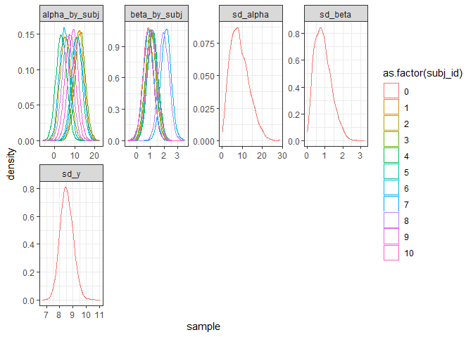<!-- -->

```r
# Quantile function with updated probs
# https://www.tidyverse.org/blog/2023/02/dplyr-1-1-0-pick-reframe-arrange/
quantile_df <- function(x, probs = c(0.025, 0.5, 0.975)) {
  tibble(
    value = quantile(x, probs, na.rm = TRUE),
    prob = probs
  )
}

# ALPHA PARAMETER
# 
# plot(x = true_linear$beta,
#      y = colMeans(par$beta_by_subj)
#      )

df_wide_quantiles <- df_long %>%
                        filter(parameter == 'alpha_by_subj') %>%
                        reframe(quantile_df(sample), .by = subj_id) %>%
                        pivot_wider(id_cols = c(subj_id),
                                    names_from = prob,
                                    values_from = value)

names(df_wide_quantiles) <- c('subj_id', 'low', 'median', 'high')

ggplot(data = df_wide_quantiles,
       mapping = aes(y = median,
                     ymin = low,
                     ymax = high,
                     colour = as.factor(subj_id))
       ) +
    geom_point(aes(x = true_linear$alpha,
                   y = true_linear$alpha)) +
    geom_errorbar(aes(x = true_linear$alpha),
                  width=.2) +
    theme_bw()
```

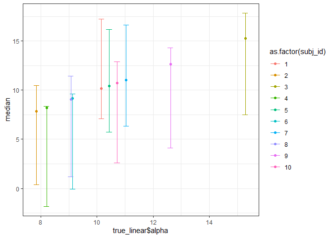<!-- -->

```r
# BETA PARAMETER
df_wide_quantiles <- df_long %>%
                        filter(parameter == 'beta_by_subj') %>%
                        reframe(quantile_df(sample), .by = subj_id) %>%
                        pivot_wider(id_cols = c(subj_id),
                                    names_from = prob,
                                    values_from = value)

names(df_wide_quantiles) <- c('subj_id', 'low', 'median', 'high')

ggplot(data = df_wide_quantiles,
       mapping = aes(y = median,
                     ymin = low,
                     ymax = high,
                     colour = as.factor(subj_id))
       ) +
    geom_point(aes(x = true_linear$beta,
                   y = true_linear$beta)) +
    geom_errorbar(aes(x = true_linear$beta),
                  width=.1) +
    theme_bw()
```

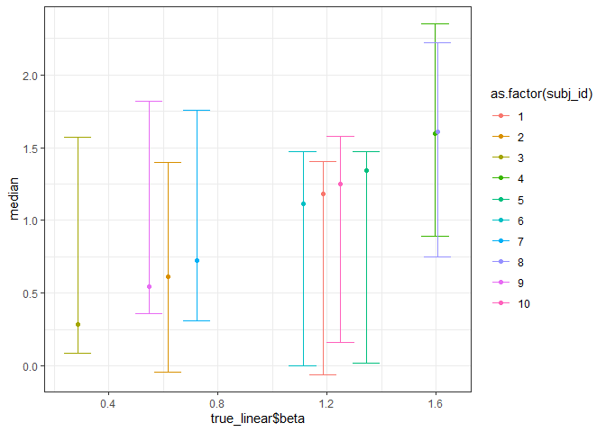<!-- -->

The estimates are very wide at this point, representing the fact that the measurement
noise (sd_y) is quite high, and we only have two measurements per x value. If we were
able to re-run the experiment, perhaps we would improve the measurements - or simply
try to collect more measurements per x value! But if we cannot easily re-do the
experiment, we can still improve the fit by making some additions to the model.

i) Assume that the individuals represent draws from a normally distributed population.
ii) Assume that the parameters come from a multivariate normal distribution


```r
# The updated stan file is using hierarchical priors on the subjects' parameters.
# alpha_by_subj ~ normal(alpha_mean, sd_alpha;
hierarchical_linear_fit <- rstan::stan(file = 'stan scripts/centered_hierarchical_linear.stan',
                                       model_name = 'hierarchical_linear',
                                       data = linear_data_for_stan,
                                       chains = 4,
                                       cores = 4,
                                       iter = 4000,
                                       warmup = 2000,
                                       control = list(adapt_delta = 0.99)
                                       ) 
```

```
## Warning: There were 96 divergent transitions after warmup. See
## https://mc-stan.org/misc/warnings.html#divergent-transitions-after-warmup
## to find out why this is a problem and how to eliminate them.
```

```
## Warning: Examine the pairs() plot to diagnose sampling problems
```

```
## Warning: Tail Effective Samples Size (ESS) is too low, indicating posterior variances and tail quantiles may be unreliable.
## Running the chains for more iterations may help. See
## https://mc-stan.org/misc/warnings.html#tail-ess
```

```r
# There are a number of error messages about divergent transitions - this is standard
# when running not-yet optimised hierarchical models and it is not a major concern
# until they start to ramp up in numbers in more complex models. We can sort them
# straight away though - these divergent transitions are caused by the
# correlations between the parameters-by-subj and the group mean.
# A simple trick is to used the 'non-centered parameterisation' which
# treats each subject's value as the sum of the mean and some 'raw' subject effect,
# which is the difference between the subject's value and the mean, measured in
# standard deviations.
# alpha_by_subj = alpha_mean + alpha_by_subj_raw * sd_alpha;
# We then put a 'standard normal' prior on the raw subject value
# alpha_by_subj_raw ~ normal(0, 3);
# (Note that the function std_normal() is identifical to normal(0, 3))

hierarchical_linear_fit <- rstan::stan(file = 'stan scripts/hierarchical_linear.stan',
                                       model_name = 'hierarchical_linear',
                                       data = linear_data_for_stan,
                                       chains = 4,
                                       cores = 4,
                                       iter = 4000,
                                       warmup = 2000,
                                       control = list(adapt_delta = 0.99)
                                       )

# Hopefully no divergent transitions! The alpha_by_subj_raw does NOT interact
# in the same way with the overall mean, and the sampler runs smoothly.

# Inspect the trace plots - we want them to look like 'hairy caterpillars''
# https://druedin.com/2016/12/26/that-hairy-caterpillar/
rstan::traceplot(hierarchical_linear_fit)
```

```
## 'pars' not specified. Showing first 10 parameters by default.
```

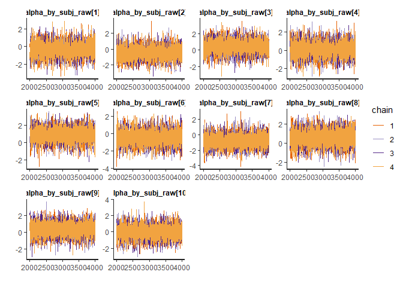<!-- -->

```r
# Create summary object and print out the overall summary (a.k.a. summary$summary)
summary <- rstan::summary(hierarchical_linear_fit,
                     probs = c(0.025, 0.5, 0.975)
                     )

# We want all the Rhats to be less than 1.01, and we need n_eff to be >100 but
# ideally in the thousands
round(summary$summary, 2)
```

```
##                          mean se_mean   sd    2.5%     50%   97.5%    n_eff
## alpha_by_subj_raw[1]     0.70    0.01 0.71   -0.73    0.70    2.07  7074.10
## alpha_by_subj_raw[2]    -0.52    0.01 0.70   -1.96   -0.50    0.86  6347.43
## alpha_by_subj_raw[3]     0.81    0.01 0.71   -0.66    0.81    2.20  5936.49
## alpha_by_subj_raw[4]    -0.89    0.01 0.72   -2.32   -0.88    0.50  6246.29
## alpha_by_subj_raw[5]     0.47    0.01 0.70   -0.91    0.48    1.87  5957.27
## alpha_by_subj_raw[6]    -0.61    0.01 0.70   -2.03   -0.60    0.76  6860.88
## alpha_by_subj_raw[7]     0.60    0.01 0.68   -0.76    0.61    1.97  6596.04
## alpha_by_subj_raw[8]    -0.33    0.01 0.70   -1.72   -0.32    1.04  6755.10
## alpha_by_subj_raw[9]     0.18    0.01 0.70   -1.20    0.19    1.57  7679.14
## alpha_by_subj_raw[10]   -0.09    0.01 0.71   -1.54   -0.07    1.31  6489.93
## beta_by_subj_raw[1]     -0.42    0.01 0.77   -1.91   -0.43    1.11  6703.98
## beta_by_subj_raw[2]     -0.21    0.01 0.75   -1.68   -0.20    1.29  7758.85
## beta_by_subj_raw[3]     -0.24    0.01 0.74   -1.71   -0.23    1.19  7101.45
## beta_by_subj_raw[4]     -0.05    0.01 0.76   -1.56   -0.05    1.46  6674.88
## beta_by_subj_raw[5]     -0.07    0.01 0.75   -1.53   -0.07    1.42  7643.05
## beta_by_subj_raw[6]      1.09    0.01 0.78   -0.49    1.10    2.64  6591.09
## beta_by_subj_raw[7]     -0.40    0.01 0.76   -1.89   -0.39    1.12  7439.36
## beta_by_subj_raw[8]      0.90    0.01 0.77   -0.64    0.90    2.37  6537.93
## beta_by_subj_raw[9]     -0.12    0.01 0.74   -1.57   -0.12    1.38  7307.60
## beta_by_subj_raw[10]    -0.46    0.01 0.77   -1.98   -0.46    1.06  6865.28
## alpha_mean               8.82    0.02 1.43    5.87    8.84   11.60  3397.57
## beta_mean                1.21    0.00 0.19    0.83    1.21    1.57  3863.62
## sd_alpha                 3.44    0.03 1.53    0.95    3.26    6.98  2421.06
## sd_beta                  0.40    0.00 0.19    0.10    0.38    0.85  2917.21
## sd_y                     8.52    0.01 0.49    7.61    8.50    9.53  8054.98
## alpha_by_subj[1]        11.23    0.02 2.26    7.13   11.10   15.89  8664.53
## alpha_by_subj[2]         7.10    0.02 2.20    2.53    7.22   11.13  9662.60
## alpha_by_subj[3]        11.58    0.03 2.29    7.41   11.45   16.23  7873.44
## alpha_by_subj[4]         5.83    0.03 2.37    0.91    5.97   10.11  6705.47
## alpha_by_subj[5]        10.44    0.02 2.13    6.44   10.37   14.81  9490.72
## alpha_by_subj[6]         6.80    0.02 2.22    2.21    6.92   10.84  8473.34
## alpha_by_subj[7]        10.89    0.02 2.18    6.83   10.78   15.45  9472.08
## alpha_by_subj[8]         7.73    0.02 2.12    3.22    7.82   11.72 10829.48
## alpha_by_subj[9]         9.45    0.02 2.12    5.30    9.44   13.77 12974.05
## alpha_by_subj[10]        8.56    0.02 2.12    4.28    8.57   12.82 11085.01
## beta_by_subj[1]          1.04    0.00 0.29    0.43    1.05    1.58  9446.69
## beta_by_subj[2]          1.12    0.00 0.28    0.55    1.13    1.66 11714.89
## beta_by_subj[3]          1.11    0.00 0.28    0.53    1.12    1.64 11556.59
## beta_by_subj[4]          1.18    0.00 0.28    0.63    1.19    1.73 12579.97
## beta_by_subj[5]          1.18    0.00 0.28    0.61    1.18    1.71 11614.67
## beta_by_subj[6]          1.65    0.00 0.34    1.06    1.63    2.38  5507.85
## beta_by_subj[7]          1.04    0.00 0.28    0.44    1.06    1.55  9647.99
## beta_by_subj[8]          1.57    0.00 0.32    1.01    1.55    2.24  6535.99
## beta_by_subj[9]          1.16    0.00 0.28    0.60    1.17    1.70 11357.07
## beta_by_subj[10]         1.02    0.00 0.29    0.41    1.04    1.55  9801.91
## lp__                  -304.08    0.11 4.89 -314.39 -303.78 -295.48  1999.91
##                       Rhat
## alpha_by_subj_raw[1]     1
## alpha_by_subj_raw[2]     1
## alpha_by_subj_raw[3]     1
## alpha_by_subj_raw[4]     1
## alpha_by_subj_raw[5]     1
## alpha_by_subj_raw[6]     1
## alpha_by_subj_raw[7]     1
## alpha_by_subj_raw[8]     1
## alpha_by_subj_raw[9]     1
## alpha_by_subj_raw[10]    1
## beta_by_subj_raw[1]      1
## beta_by_subj_raw[2]      1
## beta_by_subj_raw[3]      1
## beta_by_subj_raw[4]      1
## beta_by_subj_raw[5]      1
## beta_by_subj_raw[6]      1
## beta_by_subj_raw[7]      1
## beta_by_subj_raw[8]      1
## beta_by_subj_raw[9]      1
## beta_by_subj_raw[10]     1
## alpha_mean               1
## beta_mean                1
## sd_alpha                 1
## sd_beta                  1
## sd_y                     1
## alpha_by_subj[1]         1
## alpha_by_subj[2]         1
## alpha_by_subj[3]         1
## alpha_by_subj[4]         1
## alpha_by_subj[5]         1
## alpha_by_subj[6]         1
## alpha_by_subj[7]         1
## alpha_by_subj[8]         1
## alpha_by_subj[9]         1
## alpha_by_subj[10]        1
## beta_by_subj[1]          1
## beta_by_subj[2]          1
## beta_by_subj[3]          1
## beta_by_subj[4]          1
## beta_by_subj[5]          1
## beta_by_subj[6]          1
## beta_by_subj[7]          1
## beta_by_subj[8]          1
## beta_by_subj[9]          1
## beta_by_subj[10]         1
## lp__                     1
```

```r
# Extract the posterior distributions from the fit
par <- rstan::extract(hierarchical_linear_fit)

par_names <- c('alpha_mean',
               'beta_mean',
               'alpha_by_subj',
               'beta_by_subj',
               'sd_alpha',
               'sd_beta',
               'sd_y')

for (s in 1:N) {
    if (s == 1) {
        df <- data.frame(
            subj_id = vector(),
            iter = vector(),
            alpha_by_subj = vector(),
            beta_by_subj = vector()
        )
    }
    
    df <- rbind(df,
                data.frame(
                    subj_id = rep(s, length(par$alpha_by_subj[, s])),
                    iter = 1:length(par$alpha_by_subj[, s]),
                    alpha_by_subj = par$alpha_by_subj[, s],
                    beta_by_subj = par$beta_by_subj[, s]
                    )
                )
}

df_long <- pivot_longer(data = df,
                        cols = !c(subj_id, iter),
                        names_to = 'parameter',
                        values_to = 'sample')

df_long <- rbind(df_long,
                 data.frame(
                    subj_id = rep(0, length(par$sd_y)),
                    iter = 1:length(length(par$sd_y)),
                    parameter = 'alpha_mean',
                    sample = par$alpha_mean
                    ),
                 data.frame(
                    subj_id = rep(0, length(par$sd_y)),
                    iter = 1:length(length(par$sd_y)),
                    parameter = 'beta_mean',
                    sample = par$beta_mean
                    ),
                 data.frame(
                    subj_id = rep(0, length(par$sd_y)),
                    iter = 1:length(length(par$sd_y)),
                    parameter = 'sd_alpha',
                    sample = par$sd_alpha
                    ),
                 data.frame(
                    subj_id = rep(0, length(par$sd_y)),
                    iter = 1:length(length(par$sd_y)),
                    parameter = 'sd_beta',
                    sample = par$sd_beta
                    ),
                 data.frame(
                    subj_id = rep(0, length(par$sd_y)),
                    iter = 1:length(length(par$sd_y)),
                    parameter = 'sd_y',
                    sample = par$sd_y
                    )
                 )
    
par_names <- unique(df_long$parameter)

# Make the parameter column a factor for easier data handling and graphing
df_long$parameter <- factor(x = df_long$parameter,
                            levels = par_names
                            )

# Plot the probability densities with vertical lines (geom_vline) at 'real' value
ggplot(data = df_long,
       mapping = aes(x = sample,
                     colour = as.factor(subj_id))
       ) +
    facet_wrap(~ parameter,
               scales = 'free',
               ncol = 4) +
    geom_density() +
    theme_bw()
```

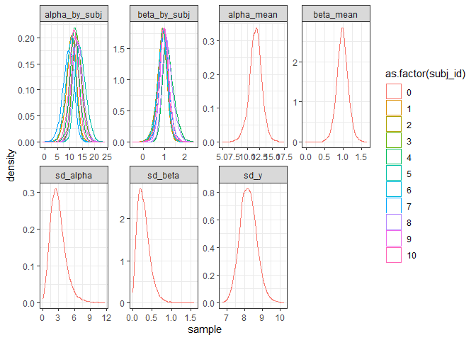<!-- -->

```r
# Quantile function with updated probs
# https://www.tidyverse.org/blog/2023/02/dplyr-1-1-0-pick-reframe-arrange/
quantile_df <- function(x, probs = c(0.025, 0.5, 0.975)) {
  tibble(
    value = quantile(x, probs, na.rm = TRUE),
    prob = probs
  )
}

# ALPHA PARAMETER
# 
# plot(x = true_linear$beta,
#      y = colMeans(par$beta_by_subj)
#      )

df_wide_quantiles <- df_long %>%
                        filter(parameter == 'alpha_by_subj') %>%
                        reframe(quantile_df(sample), .by = subj_id) %>%
                        pivot_wider(id_cols = c(subj_id),
                                    names_from = prob,
                                    values_from = value)

names(df_wide_quantiles) <- c('subj_id', 'low', 'median', 'high')

ggplot(data = df_wide_quantiles,
       mapping = aes(y = median,
                     ymin = low,
                     ymax = high,
                     colour = as.factor(subj_id))
       ) +
    geom_point(aes(x = true_linear$alpha,
                   y = true_linear$alpha)) +
    geom_errorbar(aes(x = true_linear$alpha),
                  width=.2) +
    theme_bw()
```

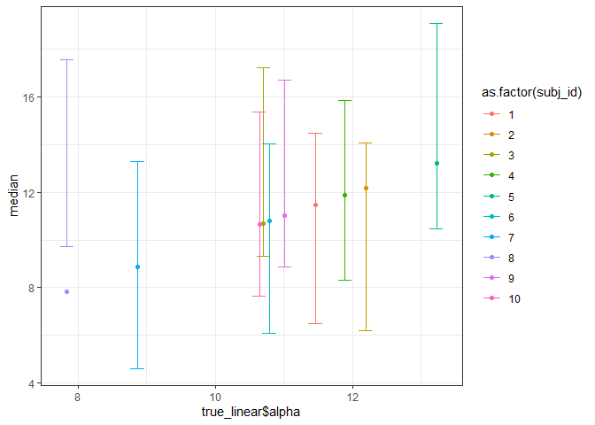<!-- -->

```r
# BETA PARAMETER
df_wide_quantiles <- df_long %>%
                        filter(parameter == 'beta_by_subj') %>%
                        reframe(quantile_df(sample), .by = subj_id) %>%
                        pivot_wider(id_cols = c(subj_id),
                                    names_from = prob,
                                    values_from = value)

names(df_wide_quantiles) <- c('subj_id', 'low', 'median', 'high')

ggplot(data = df_wide_quantiles,
       mapping = aes(y = median,
                     ymin = low,
                     ymax = high,
                     colour = as.factor(subj_id))
       ) +
    geom_point(aes(x = true_linear$beta,
                   y = true_linear$beta)) +
    geom_errorbar(aes(x = true_linear$beta),
                  width=.1) +
    theme_bw()
```

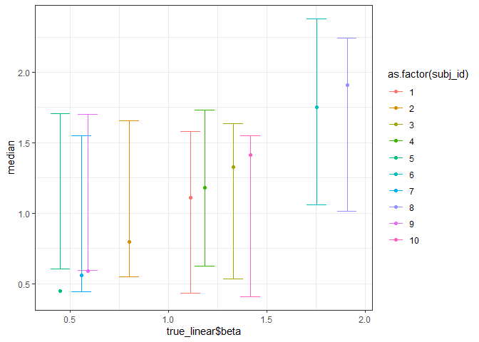<!-- -->

## Introduce correlations between parameters

In the real world, parameters can often be correlated. Imagine for instance
that subjects with a high intercept have a lower slope parameter.
We can simulate this using the function mvrnorm() from the MASS package in R.
This function creates a multivariate normal distribution,
which is simply a set of k parameters, each of which is normally distributed
and which are specified to share some covariance (correlations).


```r
# The function mvrnorm() requires k means but and we then need to supply a
# k x k covariance matrix Sigma, which contains information both about the
# standard deviations sigma, a vector of length k, and the correlations between
# the parameters, which can be described as a k xk correlation matrix Omega. 
# It is usually easier to specify the correlation matrix Omega,
# and simply transform it to the covariance matrix Sigma, like so:

# Update any settings?
N <- 30
n_rep <- 2
x_series <- seq(from = -10, to = 10, by = 5)
sd_y <- 10

# Create data structure
normal_data$y <- linear(alpha = true_linear$alpha[normal_data$subj_id],
                        beta = true_linear$beta[normal_data$subj_id],
                        x = normal_data$x) +
                 rnorm(n = length(normal_data$y),
                       mean = 0,
                       sd = sd_y)

Omega <- matrix(data = c(1, -0.9,
                         -0.9, 1),
                ncol = 2)

mu <- c(10, 2)
sigma <- c(1, 0.5)
 
# Transform from correlation matrix to covariance matrix
Sigma <- diag(sigma) %*% Omega %*% diag(sigma)
 
true_multi_normal <- data.frame(
                    subj_id = 1:N,
                    alpha = NA,
                    beta = NA
                    )

true_multi_normal[, 2:3] <- MASS::mvrnorm(n = N,
                                              mu = mu,
                                              Sigma = Sigma)

plot(x = true_multi_normal$alpha,
     y = true_multi_normal$beta)
```

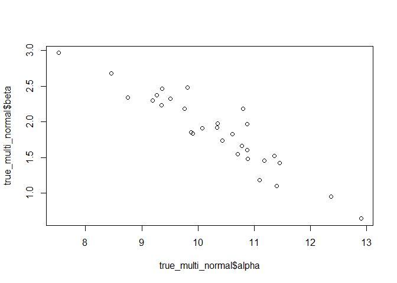<!-- -->

```r
cor(x = true_multi_normal$alpha,
    y = true_multi_normal$beta)
```

```
## [1] -0.9323351
```

```r
# We can then create a new data structure ...
multi_normal_data <- data.frame(
    subj_id = gl(n = N, k = n_rep * length(x_series)),
    rep = rep(x = 1:n_rep,
              times = N * length(x_series)),
    x = rep(x = sort(rep(x_series, n_rep)),
            times = N),
    y = NA
)

# And randomise some values (with noise)
multi_normal_data$y <-
    linear(
        alpha = true_multi_normal$alpha[multi_normal_data$subj_id],
        beta = true_multi_normal$beta[multi_normal_data$subj_id],
        x = normal_data$x
        ) +
    rnorm(n = length(multi_normal_data$y),
        mean = 0,
        sd = sd_y)
# 
# Example plots - note that slopes get lower, the higher the intercept!
ggplot(data = filter(multi_normal_data, subj_id %in% c(1, 2, 3, 4, 5, 6)),
       mapping = aes(x = x,
                     y = y,
                     colour = subj_id)) +
    geom_jitter(width = 0.1) +
    geom_smooth(method = 'lm') +
    theme_bw()
```

```
## `geom_smooth()` using formula = 'y ~ x'
```

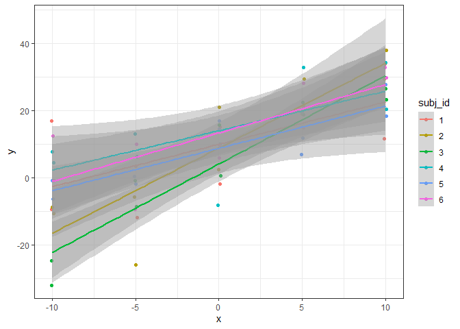<!-- -->

What happens if we try to model this in Stan?


```r
multi_normal_data_for_stan <- list(n_y = dim(multi_normal_data)[1],
                             n_subj = length(unique(multi_normal_data$subj_id)),
                             n_theta = 2,
                             subj_id = as.integer(multi_normal_data$subj_id),
                             x = multi_normal_data$x,
                             y = multi_normal_data$y)

# The model itself has got some unexpected matrix structures - those are there
# to handle the effects of within-subject conditions and between-subject effects
multi_normal_linear_fit <- rstan::stan(file = 'stan scripts/multi_normal_linear.stan',
                                       model_name = 'multi_normal_linear',
                                       data = multi_normal_data_for_stan,
                                       chains = 4,
                                       cores = 4,
                                       iter = 4000,
                                       warmup = 2000,
                                       control = list(adapt_delta = 0.99)
                                       )

# Hopefully no divergent transitions! The alpha_by_subj_raw does NOT interact
# in the same way with the overall mean, and the sampler runs smoothly.

# Inspect the trace plots - we want them to look like 'hairy caterpillars''
# https://druedin.com/2016/12/26/that-hairy-caterpillar/
rstan::traceplot(multi_normal_linear_fit)
```

```
## 'pars' not specified. Showing first 10 parameters by default.
```

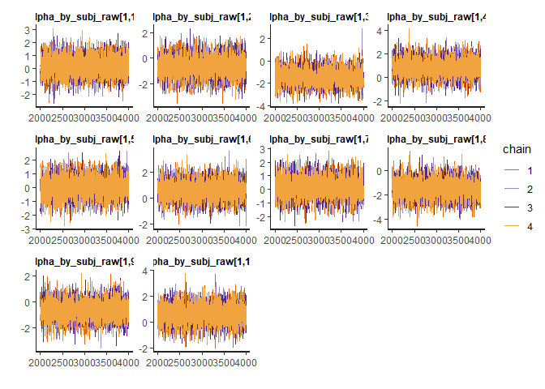<!-- -->

```r
# Create summary object and print out the overall summary (a.k.a. summary$summary)
summary <- rstan::summary(multi_normal_linear_fit,
                     probs = c(0.025, 0.5, 0.975)
                     )

# We want all the Rhats to be less than 1.01, and we need n_eff to be >100 but
# ideally in the thousands
round(summary$summary, 2)
```

```
##                            mean se_mean   sd    2.5%     50%   97.5%    n_eff
## alpha_by_subj_raw[1,1]     0.21    0.01 0.69   -1.14    0.22    1.57 10972.41
## alpha_by_subj_raw[1,2]    -0.63    0.01 0.72   -2.07   -0.63    0.81  8556.40
## alpha_by_subj_raw[1,3]    -1.38    0.01 0.68   -2.71   -1.38   -0.04 11270.18
## alpha_by_subj_raw[1,4]     0.86    0.01 0.69   -0.49    0.86    2.21 12269.42
## alpha_by_subj_raw[1,5]     0.02    0.01 0.69   -1.33    0.03    1.37 10459.68
## alpha_by_subj_raw[1,6]     0.61    0.01 0.68   -0.76    0.61    1.95 12179.21
## alpha_by_subj_raw[1,7]     0.16    0.01 0.70   -1.23    0.16    1.54 12616.55
## alpha_by_subj_raw[1,8]    -1.47    0.01 0.70   -2.86   -1.47   -0.12 10123.14
## alpha_by_subj_raw[1,9]    -0.68    0.01 0.69   -2.01   -0.68    0.67 12385.30
## alpha_by_subj_raw[1,10]    0.60    0.01 0.69   -0.77    0.60    1.97 13476.51
## alpha_by_subj_raw[1,11]    0.28    0.01 0.67   -1.04    0.29    1.58 10351.64
## alpha_by_subj_raw[1,12]    0.67    0.01 0.80   -0.95    0.68    2.22  5404.43
## alpha_by_subj_raw[1,13]    0.25    0.01 0.69   -1.13    0.26    1.60 13426.35
## alpha_by_subj_raw[1,14]    0.60    0.01 0.69   -0.78    0.59    1.97 12265.57
## alpha_by_subj_raw[1,15]    0.57    0.01 0.71   -0.85    0.57    2.00 10776.95
## alpha_by_subj_raw[1,16]   -0.14    0.01 0.68   -1.47   -0.14    1.20 11595.06
## alpha_by_subj_raw[1,17]   -1.37    0.01 0.69   -2.73   -1.36   -0.01 10888.44
## alpha_by_subj_raw[1,18]   -0.21    0.01 0.70   -1.58   -0.21    1.17 11296.46
## alpha_by_subj_raw[1,19]    0.37    0.01 0.69   -0.99    0.36    1.76 11454.39
## alpha_by_subj_raw[1,20]    0.79    0.01 0.68   -0.58    0.80    2.12 11996.36
## alpha_by_subj_raw[1,21]   -0.21    0.01 0.70   -1.63   -0.21    1.16 10479.13
## alpha_by_subj_raw[1,22]   -0.12    0.01 0.72   -1.54   -0.13    1.31  8613.97
## alpha_by_subj_raw[1,23]   -0.88    0.01 0.74   -2.32   -0.89    0.58  7745.39
## alpha_by_subj_raw[1,24]    1.32    0.01 0.70   -0.09    1.32    2.67 11278.67
## alpha_by_subj_raw[1,25]    0.10    0.01 0.71   -1.33    0.10    1.51 10672.15
## alpha_by_subj_raw[1,26]   -0.29    0.01 0.70   -1.68   -0.30    1.06 13307.43
## alpha_by_subj_raw[1,27]    0.14    0.01 0.70   -1.25    0.14    1.55 10294.03
## alpha_by_subj_raw[1,28]   -0.01    0.01 0.69   -1.37    0.00    1.33 12592.19
## alpha_by_subj_raw[1,29]    0.12    0.01 0.69   -1.23    0.12    1.46 12778.79
## alpha_by_subj_raw[1,30]    0.08    0.01 0.69   -1.27    0.08    1.45 13322.34
## beta_by_subj_raw[1,1]     -0.48    0.01 0.82   -2.05   -0.50    1.20 11582.18
## beta_by_subj_raw[1,2]      0.74    0.01 0.84   -0.98    0.76    2.32  9779.05
## beta_by_subj_raw[1,3]      0.60    0.01 0.85   -1.15    0.63    2.18  9940.75
## beta_by_subj_raw[1,4]     -0.38    0.01 0.83   -1.96   -0.40    1.31 12120.98
## beta_by_subj_raw[1,5]     -0.56    0.01 0.80   -2.07   -0.58    1.06 12716.77
## beta_by_subj_raw[1,6]     -0.13    0.01 0.81   -1.67   -0.14    1.48 14004.62
## beta_by_subj_raw[1,7]     -0.34    0.01 0.83   -1.92   -0.33    1.32 12807.71
## beta_by_subj_raw[1,8]     -0.05    0.01 0.83   -1.67   -0.04    1.55 10074.42
## beta_by_subj_raw[1,9]      0.38    0.01 0.81   -1.28    0.40    1.92 11922.71
## beta_by_subj_raw[1,10]    -0.28    0.01 0.83   -1.91   -0.29    1.40 13198.29
## beta_by_subj_raw[1,11]    -0.43    0.01 0.83   -2.00   -0.44    1.25 12229.77
## beta_by_subj_raw[1,12]    -1.50    0.01 0.89   -3.18   -1.54    0.35  6406.40
## beta_by_subj_raw[1,13]     0.13    0.01 0.82   -1.52    0.14    1.76 14785.93
## beta_by_subj_raw[1,14]     0.20    0.01 0.82   -1.43    0.20    1.83 13547.90
## beta_by_subj_raw[1,15]     0.33    0.01 0.81   -1.27    0.33    1.96 13323.56
## beta_by_subj_raw[1,16]     0.36    0.01 0.82   -1.28    0.37    1.96 12695.07
## beta_by_subj_raw[1,17]     0.29    0.01 0.85   -1.42    0.30    1.88  9329.08
## beta_by_subj_raw[1,18]     0.46    0.01 0.82   -1.19    0.47    2.07 13188.09
## beta_by_subj_raw[1,19]     0.33    0.01 0.83   -1.34    0.34    1.98 14761.01
## beta_by_subj_raw[1,20]     0.09    0.01 0.81   -1.49    0.10    1.69 13236.79
## beta_by_subj_raw[1,21]    -0.40    0.01 0.81   -2.01   -0.40    1.22 14148.07
## beta_by_subj_raw[1,22]     0.82    0.01 0.83   -0.87    0.84    2.38 10075.23
## beta_by_subj_raw[1,23]     1.05    0.01 0.87   -0.77    1.10    2.64  8254.70
## beta_by_subj_raw[1,24]    -0.72    0.01 0.86   -2.33   -0.74    1.02  9615.55
## beta_by_subj_raw[1,25]    -0.56    0.01 0.82   -2.16   -0.58    1.09 12631.78
## beta_by_subj_raw[1,26]    -0.12    0.01 0.81   -1.74   -0.12    1.49 14331.58
## beta_by_subj_raw[1,27]     0.41    0.01 0.81   -1.24    0.42    2.03 13702.56
## beta_by_subj_raw[1,28]     0.11    0.01 0.83   -1.50    0.12    1.77 14429.75
## beta_by_subj_raw[1,29]    -0.17    0.01 0.80   -1.72   -0.17    1.45 12948.36
## beta_by_subj_raw[1,30]    -0.16    0.01 0.82   -1.76   -0.16    1.46 13218.98
## alpha_mean[1]             10.23    0.01 0.67    8.88   10.24   11.53  6311.54
## beta_mean[1]               1.73    0.00 0.11    1.52    1.73    1.95  6120.41
## sd_alpha[1]                2.42    0.01 0.72    1.06    2.39    3.91  3922.37
## sd_beta[1]                 0.47    0.00 0.11    0.28    0.46    0.70  3902.92
## sd_y                       8.29    0.00 0.33    7.67    8.29    8.95 11093.70
## Omega[1,1]                 1.00     NaN 0.00    1.00    1.00    1.00      NaN
## Omega[1,2]                -0.63    0.01 0.27   -0.98   -0.68    0.00  2434.38
## Omega[2,1]                -0.63    0.01 0.27   -0.98   -0.68    0.00  2434.38
## Omega[2,2]                 1.00    0.00 0.00    1.00    1.00    1.00  7923.47
## theta_means[1]            10.23    0.01 0.67    8.88   10.24   11.53  6311.54
## theta_means[2]             1.73    0.00 0.11    1.52    1.73    1.95  6120.41
## sd_theta[1]                2.42    0.01 0.72    1.06    2.39    3.91  3922.37
## sd_theta[2]                0.47    0.00 0.11    0.28    0.46    0.70  3902.92
## theta_by_subj_raw[1,1]     0.21    0.01 0.69   -1.14    0.22    1.57 10972.41
## theta_by_subj_raw[1,2]    -0.63    0.01 0.72   -2.07   -0.63    0.81  8556.40
## theta_by_subj_raw[1,3]    -1.38    0.01 0.68   -2.71   -1.38   -0.04 11270.18
## theta_by_subj_raw[1,4]     0.86    0.01 0.69   -0.49    0.86    2.21 12269.42
## theta_by_subj_raw[1,5]     0.02    0.01 0.69   -1.33    0.03    1.37 10459.68
## theta_by_subj_raw[1,6]     0.61    0.01 0.68   -0.76    0.61    1.95 12179.21
## theta_by_subj_raw[1,7]     0.16    0.01 0.70   -1.23    0.16    1.54 12616.55
## theta_by_subj_raw[1,8]    -1.47    0.01 0.70   -2.86   -1.47   -0.12 10123.14
## theta_by_subj_raw[1,9]    -0.68    0.01 0.69   -2.01   -0.68    0.67 12385.30
## theta_by_subj_raw[1,10]    0.60    0.01 0.69   -0.77    0.60    1.97 13476.51
## theta_by_subj_raw[1,11]    0.28    0.01 0.67   -1.04    0.29    1.58 10351.64
## theta_by_subj_raw[1,12]    0.67    0.01 0.80   -0.95    0.68    2.22  5404.43
## theta_by_subj_raw[1,13]    0.25    0.01 0.69   -1.13    0.26    1.60 13426.35
## theta_by_subj_raw[1,14]    0.60    0.01 0.69   -0.78    0.59    1.97 12265.57
## theta_by_subj_raw[1,15]    0.57    0.01 0.71   -0.85    0.57    2.00 10776.95
## theta_by_subj_raw[1,16]   -0.14    0.01 0.68   -1.47   -0.14    1.20 11595.06
## theta_by_subj_raw[1,17]   -1.37    0.01 0.69   -2.73   -1.36   -0.01 10888.44
## theta_by_subj_raw[1,18]   -0.21    0.01 0.70   -1.58   -0.21    1.17 11296.46
## theta_by_subj_raw[1,19]    0.37    0.01 0.69   -0.99    0.36    1.76 11454.39
## theta_by_subj_raw[1,20]    0.79    0.01 0.68   -0.58    0.80    2.12 11996.36
## theta_by_subj_raw[1,21]   -0.21    0.01 0.70   -1.63   -0.21    1.16 10479.13
## theta_by_subj_raw[1,22]   -0.12    0.01 0.72   -1.54   -0.13    1.31  8613.97
## theta_by_subj_raw[1,23]   -0.88    0.01 0.74   -2.32   -0.89    0.58  7745.39
## theta_by_subj_raw[1,24]    1.32    0.01 0.70   -0.09    1.32    2.67 11278.67
## theta_by_subj_raw[1,25]    0.10    0.01 0.71   -1.33    0.10    1.51 10672.15
## theta_by_subj_raw[1,26]   -0.29    0.01 0.70   -1.68   -0.30    1.06 13307.43
## theta_by_subj_raw[1,27]    0.14    0.01 0.70   -1.25    0.14    1.55 10294.03
## theta_by_subj_raw[1,28]   -0.01    0.01 0.69   -1.37    0.00    1.33 12592.19
## theta_by_subj_raw[1,29]    0.12    0.01 0.69   -1.23    0.12    1.46 12778.79
## theta_by_subj_raw[1,30]    0.08    0.01 0.69   -1.27    0.08    1.45 13322.34
## theta_by_subj_raw[2,1]    -0.48    0.01 0.82   -2.05   -0.50    1.20 11582.18
## theta_by_subj_raw[2,2]     0.74    0.01 0.84   -0.98    0.76    2.32  9779.05
## theta_by_subj_raw[2,3]     0.60    0.01 0.85   -1.15    0.63    2.18  9940.75
## theta_by_subj_raw[2,4]    -0.38    0.01 0.83   -1.96   -0.40    1.31 12120.98
## theta_by_subj_raw[2,5]    -0.56    0.01 0.80   -2.07   -0.58    1.06 12716.77
## theta_by_subj_raw[2,6]    -0.13    0.01 0.81   -1.67   -0.14    1.48 14004.62
## theta_by_subj_raw[2,7]    -0.34    0.01 0.83   -1.92   -0.33    1.32 12807.71
## theta_by_subj_raw[2,8]    -0.05    0.01 0.83   -1.67   -0.04    1.55 10074.42
## theta_by_subj_raw[2,9]     0.38    0.01 0.81   -1.28    0.40    1.92 11922.71
## theta_by_subj_raw[2,10]   -0.28    0.01 0.83   -1.91   -0.29    1.40 13198.29
## theta_by_subj_raw[2,11]   -0.43    0.01 0.83   -2.00   -0.44    1.25 12229.77
## theta_by_subj_raw[2,12]   -1.50    0.01 0.89   -3.18   -1.54    0.35  6406.40
## theta_by_subj_raw[2,13]    0.13    0.01 0.82   -1.52    0.14    1.76 14785.93
## theta_by_subj_raw[2,14]    0.20    0.01 0.82   -1.43    0.20    1.83 13547.90
## theta_by_subj_raw[2,15]    0.33    0.01 0.81   -1.27    0.33    1.96 13323.56
## theta_by_subj_raw[2,16]    0.36    0.01 0.82   -1.28    0.37    1.96 12695.07
## theta_by_subj_raw[2,17]    0.29    0.01 0.85   -1.42    0.30    1.88  9329.08
## theta_by_subj_raw[2,18]    0.46    0.01 0.82   -1.19    0.47    2.07 13188.09
## theta_by_subj_raw[2,19]    0.33    0.01 0.83   -1.34    0.34    1.98 14761.01
## theta_by_subj_raw[2,20]    0.09    0.01 0.81   -1.49    0.10    1.69 13236.79
## theta_by_subj_raw[2,21]   -0.40    0.01 0.81   -2.01   -0.40    1.22 14148.07
## theta_by_subj_raw[2,22]    0.82    0.01 0.83   -0.87    0.84    2.38 10075.23
## theta_by_subj_raw[2,23]    1.05    0.01 0.87   -0.77    1.10    2.64  8254.70
## theta_by_subj_raw[2,24]   -0.72    0.01 0.86   -2.33   -0.74    1.02  9615.55
## theta_by_subj_raw[2,25]   -0.56    0.01 0.82   -2.16   -0.58    1.09 12631.78
## theta_by_subj_raw[2,26]   -0.12    0.01 0.81   -1.74   -0.12    1.49 14331.58
## theta_by_subj_raw[2,27]    0.41    0.01 0.81   -1.24    0.42    2.03 13702.56
## theta_by_subj_raw[2,28]    0.11    0.01 0.83   -1.50    0.12    1.77 14429.75
## theta_by_subj_raw[2,29]   -0.17    0.01 0.80   -1.72   -0.17    1.45 12948.36
## theta_by_subj_raw[2,30]   -0.16    0.01 0.82   -1.76   -0.16    1.46 13218.98
## theta_by_subj[1,1]        10.70    0.02 1.64    7.29   10.71   13.88 11721.28
## theta_by_subj[1,2]         8.76    0.02 1.72    5.31    8.81   12.10  9670.26
## theta_by_subj[1,3]         6.91    0.02 1.85    3.02    6.99   10.25  8200.02
## theta_by_subj[1,4]        12.31    0.02 1.72    9.11   12.22   15.95 11652.29
## theta_by_subj[1,5]        10.23    0.02 1.66    6.83   10.30   13.41 11893.62
## theta_by_subj[1,6]        11.71    0.02 1.69    8.56   11.65   15.22 12011.04
## theta_by_subj[1,7]        10.60    0.02 1.66    7.22   10.57   13.91 12164.93
## theta_by_subj[1,8]         6.62    0.02 2.03    2.33    6.75   10.18  6686.45
## theta_by_subj[1,9]         8.60    0.02 1.70    5.05    8.69   11.76 12013.23
## theta_by_subj[1,10]       11.69    0.02 1.69    8.53   11.63   15.12 11614.72
## theta_by_subj[1,11]       10.87    0.01 1.61    7.70   10.87   14.04 12457.99
## theta_by_subj[1,12]       11.74    0.02 1.83    7.96   11.79   15.19  5998.35
## theta_by_subj[1,13]       10.86    0.01 1.66    7.65   10.80   14.34 13698.75
## theta_by_subj[1,14]       11.72    0.02 1.70    8.68   11.62   15.31 11070.49
## theta_by_subj[1,15]       11.67    0.02 1.77    8.45   11.56   15.44  9697.96
## theta_by_subj[1,16]        9.93    0.01 1.63    6.69    9.94   13.15 13276.06
## theta_by_subj[1,17]        6.89    0.02 1.93    2.81    7.02   10.31  8579.30
## theta_by_subj[1,18]        9.76    0.01 1.64    6.57    9.75   13.08 12286.14
## theta_by_subj[1,19]       11.15    0.02 1.69    7.97   11.07   14.70 12116.31
## theta_by_subj[1,20]       12.18    0.02 1.75    9.02   12.08   15.95  9688.81
## theta_by_subj[1,21]        9.67    0.02 1.68    6.13    9.75   12.78 11215.61
## theta_by_subj[1,22]       10.01    0.02 1.72    6.72    9.94   13.59  9200.80
## theta_by_subj[1,23]        8.17    0.02 1.76    4.65    8.19   11.54  8188.71
## theta_by_subj[1,24]       13.40    0.02 1.84    9.99   13.33   17.11  8441.21
## theta_by_subj[1,25]       10.43    0.02 1.68    6.90   10.49   13.67 11094.15
## theta_by_subj[1,26]        9.49    0.01 1.70    5.94    9.55   12.67 13811.77
## theta_by_subj[1,27]       10.60    0.02 1.69    7.35   10.55   14.10 11558.02
## theta_by_subj[1,28]       10.23    0.01 1.62    6.92   10.22   13.47 14437.58
## theta_by_subj[1,29]       10.49    0.01 1.63    7.25   10.49   13.76 12979.41
## theta_by_subj[1,30]       10.39    0.01 1.64    7.08   10.41   13.62 13281.75
## theta_by_subj[2,1]         1.49    0.00 0.28    0.93    1.49    2.02 12793.24
## theta_by_subj[2,2]         2.20    0.00 0.29    1.65    2.19    2.78 10234.06
## theta_by_subj[2,3]         2.36    0.00 0.30    1.80    2.36    2.99 10499.18
## theta_by_subj[2,4]         1.34    0.00 0.29    0.77    1.34    1.88 10761.26
## theta_by_subj[2,5]         1.52    0.00 0.28    0.95    1.52    2.06 12106.02
## theta_by_subj[2,6]         1.50    0.00 0.28    0.96    1.50    2.04 12483.52
## theta_by_subj[2,7]         1.55    0.00 0.28    1.00    1.56    2.07 12212.96
## theta_by_subj[2,8]         2.14    0.00 0.30    1.56    2.14    2.73  9139.13
## theta_by_subj[2,9]         2.08    0.00 0.28    1.54    2.07    2.65 12478.47
## theta_by_subj[2,10]        1.45    0.00 0.28    0.89    1.45    2.00 14182.40
## theta_by_subj[2,11]        1.49    0.00 0.28    0.93    1.49    2.02 12730.85
## theta_by_subj[2,12]        0.97    0.00 0.33    0.29    0.98    1.59  6118.34
## theta_by_subj[2,13]        1.71    0.00 0.28    1.15    1.71    2.26 13474.11
## theta_by_subj[2,14]        1.63    0.00 0.28    1.09    1.63    2.21 11823.04
## theta_by_subj[2,15]        1.69    0.00 0.28    1.14    1.69    2.25 11524.09
## theta_by_subj[2,16]        1.91    0.00 0.28    1.38    1.90    2.46 12587.85
## theta_by_subj[2,17]        2.24    0.00 0.30    1.67    2.24    2.82  9988.64
## theta_by_subj[2,18]        1.97    0.00 0.28    1.43    1.96    2.53 11708.74
## theta_by_subj[2,19]        1.74    0.00 0.28    1.19    1.74    2.31 11076.80
## theta_by_subj[2,20]        1.54    0.00 0.28    0.99    1.53    2.07 11191.48
## theta_by_subj[2,21]        1.64    0.00 0.28    1.07    1.65    2.19 14377.65
## theta_by_subj[2,22]        2.08    0.00 0.29    1.54    2.07    2.68  9253.24
## theta_by_subj[2,23]        2.39    0.00 0.31    1.81    2.38    3.00  9140.65
## theta_by_subj[2,24]        1.07    0.00 0.30    0.47    1.08    1.63  8254.08
## theta_by_subj[2,25]        1.48    0.00 0.28    0.91    1.49    2.02 10897.91
## theta_by_subj[2,26]        1.77    0.00 0.28    1.21    1.77    2.33 14340.67
## theta_by_subj[2,27]        1.85    0.00 0.28    1.32    1.84    2.42 12137.07
## theta_by_subj[2,28]        1.78    0.00 0.27    1.24    1.77    2.32 16175.22
## theta_by_subj[2,29]        1.63    0.00 0.27    1.11    1.63    2.16 12413.31
## theta_by_subj[2,30]        1.65    0.00 0.28    1.08    1.65    2.20 15021.54
## alpha_by_subj[1,1]        10.70    0.02 1.64    7.29   10.71   13.88 11721.28
## alpha_by_subj[1,2]         8.76    0.02 1.72    5.31    8.81   12.10  9670.26
## alpha_by_subj[1,3]         6.91    0.02 1.85    3.02    6.99   10.25  8200.02
## alpha_by_subj[1,4]        12.31    0.02 1.72    9.11   12.22   15.95 11652.29
## alpha_by_subj[1,5]        10.23    0.02 1.66    6.83   10.30   13.41 11893.62
## alpha_by_subj[1,6]        11.71    0.02 1.69    8.56   11.65   15.22 12011.04
## alpha_by_subj[1,7]        10.60    0.02 1.66    7.22   10.57   13.91 12164.93
## alpha_by_subj[1,8]         6.62    0.02 2.03    2.33    6.75   10.18  6686.45
## alpha_by_subj[1,9]         8.60    0.02 1.70    5.05    8.69   11.76 12013.23
## alpha_by_subj[1,10]       11.69    0.02 1.69    8.53   11.63   15.12 11614.72
## alpha_by_subj[1,11]       10.87    0.01 1.61    7.70   10.87   14.04 12457.99
## alpha_by_subj[1,12]       11.74    0.02 1.83    7.96   11.79   15.19  5998.35
## alpha_by_subj[1,13]       10.86    0.01 1.66    7.65   10.80   14.34 13698.75
## alpha_by_subj[1,14]       11.72    0.02 1.70    8.68   11.62   15.31 11070.49
## alpha_by_subj[1,15]       11.67    0.02 1.77    8.45   11.56   15.44  9697.96
## alpha_by_subj[1,16]        9.93    0.01 1.63    6.69    9.94   13.15 13276.06
## alpha_by_subj[1,17]        6.89    0.02 1.93    2.81    7.02   10.31  8579.30
## alpha_by_subj[1,18]        9.76    0.01 1.64    6.57    9.75   13.08 12286.14
## alpha_by_subj[1,19]       11.15    0.02 1.69    7.97   11.07   14.70 12116.31
## alpha_by_subj[1,20]       12.18    0.02 1.75    9.02   12.08   15.95  9688.81
## alpha_by_subj[1,21]        9.67    0.02 1.68    6.13    9.75   12.78 11215.61
## alpha_by_subj[1,22]       10.01    0.02 1.72    6.72    9.94   13.59  9200.80
## alpha_by_subj[1,23]        8.17    0.02 1.76    4.65    8.19   11.54  8188.71
## alpha_by_subj[1,24]       13.40    0.02 1.84    9.99   13.33   17.11  8441.21
## alpha_by_subj[1,25]       10.43    0.02 1.68    6.90   10.49   13.67 11094.15
## alpha_by_subj[1,26]        9.49    0.01 1.70    5.94    9.55   12.67 13811.77
## alpha_by_subj[1,27]       10.60    0.02 1.69    7.35   10.55   14.10 11558.02
## alpha_by_subj[1,28]       10.23    0.01 1.62    6.92   10.22   13.47 14437.58
## alpha_by_subj[1,29]       10.49    0.01 1.63    7.25   10.49   13.76 12979.41
## alpha_by_subj[1,30]       10.39    0.01 1.64    7.08   10.41   13.62 13281.75
## beta_by_subj[1,1]          1.49    0.00 0.28    0.93    1.49    2.02 12793.24
## beta_by_subj[1,2]          2.20    0.00 0.29    1.65    2.19    2.78 10234.06
## beta_by_subj[1,3]          2.36    0.00 0.30    1.80    2.36    2.99 10499.18
## beta_by_subj[1,4]          1.34    0.00 0.29    0.77    1.34    1.88 10761.26
## beta_by_subj[1,5]          1.52    0.00 0.28    0.95    1.52    2.06 12106.02
## beta_by_subj[1,6]          1.50    0.00 0.28    0.96    1.50    2.04 12483.52
## beta_by_subj[1,7]          1.55    0.00 0.28    1.00    1.56    2.07 12212.96
## beta_by_subj[1,8]          2.14    0.00 0.30    1.56    2.14    2.73  9139.13
## beta_by_subj[1,9]          2.08    0.00 0.28    1.54    2.07    2.65 12478.47
## beta_by_subj[1,10]         1.45    0.00 0.28    0.89    1.45    2.00 14182.40
## beta_by_subj[1,11]         1.49    0.00 0.28    0.93    1.49    2.02 12730.85
## beta_by_subj[1,12]         0.97    0.00 0.33    0.29    0.98    1.59  6118.34
## beta_by_subj[1,13]         1.71    0.00 0.28    1.15    1.71    2.26 13474.11
## beta_by_subj[1,14]         1.63    0.00 0.28    1.09    1.63    2.21 11823.04
## beta_by_subj[1,15]         1.69    0.00 0.28    1.14    1.69    2.25 11524.09
## beta_by_subj[1,16]         1.91    0.00 0.28    1.38    1.90    2.46 12587.85
## beta_by_subj[1,17]         2.24    0.00 0.30    1.67    2.24    2.82  9988.64
## beta_by_subj[1,18]         1.97    0.00 0.28    1.43    1.96    2.53 11708.74
## beta_by_subj[1,19]         1.74    0.00 0.28    1.19    1.74    2.31 11076.80
## beta_by_subj[1,20]         1.54    0.00 0.28    0.99    1.53    2.07 11191.48
## beta_by_subj[1,21]         1.64    0.00 0.28    1.07    1.65    2.19 14377.65
## beta_by_subj[1,22]         2.08    0.00 0.29    1.54    2.07    2.68  9253.24
## beta_by_subj[1,23]         2.39    0.00 0.31    1.81    2.38    3.00  9140.65
## beta_by_subj[1,24]         1.07    0.00 0.30    0.47    1.08    1.63  8254.08
## beta_by_subj[1,25]         1.48    0.00 0.28    0.91    1.49    2.02 10897.91
## beta_by_subj[1,26]         1.77    0.00 0.28    1.21    1.77    2.33 14340.67
## beta_by_subj[1,27]         1.85    0.00 0.28    1.32    1.84    2.42 12137.07
## beta_by_subj[1,28]         1.78    0.00 0.27    1.24    1.77    2.32 16175.22
## beta_by_subj[1,29]         1.63    0.00 0.27    1.11    1.63    2.16 12413.31
## beta_by_subj[1,30]         1.65    0.00 0.28    1.08    1.65    2.20 15021.54
## Sigma[1,1]                 6.38    0.06 3.72    1.12    5.73   15.27  4095.09
## Sigma[1,2]                -0.73    0.01 0.45   -1.79   -0.67    0.00  2664.96
## Sigma[2,1]                -0.73    0.01 0.45   -1.79   -0.67    0.00  2664.96
## Sigma[2,2]                 0.23    0.00 0.11    0.08    0.21    0.49  4008.43
## L[1,1]                     2.42    0.01 0.72    1.06    2.39    3.91  3922.37
## L[1,2]                     0.00     NaN 0.00    0.00    0.00    0.00      NaN
## L[2,1]                    -0.30    0.00 0.15   -0.58   -0.30    0.00  2720.54
## L[2,2]                     0.32    0.00 0.13    0.08    0.32    0.58  2447.18
## lp__                    -843.30    0.20 8.18 -860.28 -843.06 -828.13  1676.11
##                         Rhat
## alpha_by_subj_raw[1,1]     1
## alpha_by_subj_raw[1,2]     1
## alpha_by_subj_raw[1,3]     1
## alpha_by_subj_raw[1,4]     1
## alpha_by_subj_raw[1,5]     1
## alpha_by_subj_raw[1,6]     1
## alpha_by_subj_raw[1,7]     1
## alpha_by_subj_raw[1,8]     1
## alpha_by_subj_raw[1,9]     1
## alpha_by_subj_raw[1,10]    1
## alpha_by_subj_raw[1,11]    1
## alpha_by_subj_raw[1,12]    1
## alpha_by_subj_raw[1,13]    1
## alpha_by_subj_raw[1,14]    1
## alpha_by_subj_raw[1,15]    1
## alpha_by_subj_raw[1,16]    1
## alpha_by_subj_raw[1,17]    1
## alpha_by_subj_raw[1,18]    1
## alpha_by_subj_raw[1,19]    1
## alpha_by_subj_raw[1,20]    1
## alpha_by_subj_raw[1,21]    1
## alpha_by_subj_raw[1,22]    1
## alpha_by_subj_raw[1,23]    1
## alpha_by_subj_raw[1,24]    1
## alpha_by_subj_raw[1,25]    1
## alpha_by_subj_raw[1,26]    1
## alpha_by_subj_raw[1,27]    1
## alpha_by_subj_raw[1,28]    1
## alpha_by_subj_raw[1,29]    1
## alpha_by_subj_raw[1,30]    1
## beta_by_subj_raw[1,1]      1
## beta_by_subj_raw[1,2]      1
## beta_by_subj_raw[1,3]      1
## beta_by_subj_raw[1,4]      1
## beta_by_subj_raw[1,5]      1
## beta_by_subj_raw[1,6]      1
## beta_by_subj_raw[1,7]      1
## beta_by_subj_raw[1,8]      1
## beta_by_subj_raw[1,9]      1
## beta_by_subj_raw[1,10]     1
## beta_by_subj_raw[1,11]     1
## beta_by_subj_raw[1,12]     1
## beta_by_subj_raw[1,13]     1
## beta_by_subj_raw[1,14]     1
## beta_by_subj_raw[1,15]     1
## beta_by_subj_raw[1,16]     1
## beta_by_subj_raw[1,17]     1
## beta_by_subj_raw[1,18]     1
## beta_by_subj_raw[1,19]     1
## beta_by_subj_raw[1,20]     1
## beta_by_subj_raw[1,21]     1
## beta_by_subj_raw[1,22]     1
## beta_by_subj_raw[1,23]     1
## beta_by_subj_raw[1,24]     1
## beta_by_subj_raw[1,25]     1
## beta_by_subj_raw[1,26]     1
## beta_by_subj_raw[1,27]     1
## beta_by_subj_raw[1,28]     1
## beta_by_subj_raw[1,29]     1
## beta_by_subj_raw[1,30]     1
## alpha_mean[1]              1
## beta_mean[1]               1
## sd_alpha[1]                1
## sd_beta[1]                 1
## sd_y                       1
## Omega[1,1]               NaN
## Omega[1,2]                 1
## Omega[2,1]                 1
## Omega[2,2]                 1
## theta_means[1]             1
## theta_means[2]             1
## sd_theta[1]                1
## sd_theta[2]                1
## theta_by_subj_raw[1,1]     1
## theta_by_subj_raw[1,2]     1
## theta_by_subj_raw[1,3]     1
## theta_by_subj_raw[1,4]     1
## theta_by_subj_raw[1,5]     1
## theta_by_subj_raw[1,6]     1
## theta_by_subj_raw[1,7]     1
## theta_by_subj_raw[1,8]     1
## theta_by_subj_raw[1,9]     1
## theta_by_subj_raw[1,10]    1
## theta_by_subj_raw[1,11]    1
## theta_by_subj_raw[1,12]    1
## theta_by_subj_raw[1,13]    1
## theta_by_subj_raw[1,14]    1
## theta_by_subj_raw[1,15]    1
## theta_by_subj_raw[1,16]    1
## theta_by_subj_raw[1,17]    1
## theta_by_subj_raw[1,18]    1
## theta_by_subj_raw[1,19]    1
## theta_by_subj_raw[1,20]    1
## theta_by_subj_raw[1,21]    1
## theta_by_subj_raw[1,22]    1
## theta_by_subj_raw[1,23]    1
## theta_by_subj_raw[1,24]    1
## theta_by_subj_raw[1,25]    1
## theta_by_subj_raw[1,26]    1
## theta_by_subj_raw[1,27]    1
## theta_by_subj_raw[1,28]    1
## theta_by_subj_raw[1,29]    1
## theta_by_subj_raw[1,30]    1
## theta_by_subj_raw[2,1]     1
## theta_by_subj_raw[2,2]     1
## theta_by_subj_raw[2,3]     1
## theta_by_subj_raw[2,4]     1
## theta_by_subj_raw[2,5]     1
## theta_by_subj_raw[2,6]     1
## theta_by_subj_raw[2,7]     1
## theta_by_subj_raw[2,8]     1
## theta_by_subj_raw[2,9]     1
## theta_by_subj_raw[2,10]    1
## theta_by_subj_raw[2,11]    1
## theta_by_subj_raw[2,12]    1
## theta_by_subj_raw[2,13]    1
## theta_by_subj_raw[2,14]    1
## theta_by_subj_raw[2,15]    1
## theta_by_subj_raw[2,16]    1
## theta_by_subj_raw[2,17]    1
## theta_by_subj_raw[2,18]    1
## theta_by_subj_raw[2,19]    1
## theta_by_subj_raw[2,20]    1
## theta_by_subj_raw[2,21]    1
## theta_by_subj_raw[2,22]    1
## theta_by_subj_raw[2,23]    1
## theta_by_subj_raw[2,24]    1
## theta_by_subj_raw[2,25]    1
## theta_by_subj_raw[2,26]    1
## theta_by_subj_raw[2,27]    1
## theta_by_subj_raw[2,28]    1
## theta_by_subj_raw[2,29]    1
## theta_by_subj_raw[2,30]    1
## theta_by_subj[1,1]         1
## theta_by_subj[1,2]         1
## theta_by_subj[1,3]         1
## theta_by_subj[1,4]         1
## theta_by_subj[1,5]         1
## theta_by_subj[1,6]         1
## theta_by_subj[1,7]         1
## theta_by_subj[1,8]         1
## theta_by_subj[1,9]         1
## theta_by_subj[1,10]        1
## theta_by_subj[1,11]        1
## theta_by_subj[1,12]        1
## theta_by_subj[1,13]        1
## theta_by_subj[1,14]        1
## theta_by_subj[1,15]        1
## theta_by_subj[1,16]        1
## theta_by_subj[1,17]        1
## theta_by_subj[1,18]        1
## theta_by_subj[1,19]        1
## theta_by_subj[1,20]        1
## theta_by_subj[1,21]        1
## theta_by_subj[1,22]        1
## theta_by_subj[1,23]        1
## theta_by_subj[1,24]        1
## theta_by_subj[1,25]        1
## theta_by_subj[1,26]        1
## theta_by_subj[1,27]        1
## theta_by_subj[1,28]        1
## theta_by_subj[1,29]        1
## theta_by_subj[1,30]        1
## theta_by_subj[2,1]         1
## theta_by_subj[2,2]         1
## theta_by_subj[2,3]         1
## theta_by_subj[2,4]         1
## theta_by_subj[2,5]         1
## theta_by_subj[2,6]         1
## theta_by_subj[2,7]         1
## theta_by_subj[2,8]         1
## theta_by_subj[2,9]         1
## theta_by_subj[2,10]        1
## theta_by_subj[2,11]        1
## theta_by_subj[2,12]        1
## theta_by_subj[2,13]        1
## theta_by_subj[2,14]        1
## theta_by_subj[2,15]        1
## theta_by_subj[2,16]        1
## theta_by_subj[2,17]        1
## theta_by_subj[2,18]        1
## theta_by_subj[2,19]        1
## theta_by_subj[2,20]        1
## theta_by_subj[2,21]        1
## theta_by_subj[2,22]        1
## theta_by_subj[2,23]        1
## theta_by_subj[2,24]        1
## theta_by_subj[2,25]        1
## theta_by_subj[2,26]        1
## theta_by_subj[2,27]        1
## theta_by_subj[2,28]        1
## theta_by_subj[2,29]        1
## theta_by_subj[2,30]        1
## alpha_by_subj[1,1]         1
## alpha_by_subj[1,2]         1
## alpha_by_subj[1,3]         1
## alpha_by_subj[1,4]         1
## alpha_by_subj[1,5]         1
## alpha_by_subj[1,6]         1
## alpha_by_subj[1,7]         1
## alpha_by_subj[1,8]         1
## alpha_by_subj[1,9]         1
## alpha_by_subj[1,10]        1
## alpha_by_subj[1,11]        1
## alpha_by_subj[1,12]        1
## alpha_by_subj[1,13]        1
## alpha_by_subj[1,14]        1
## alpha_by_subj[1,15]        1
## alpha_by_subj[1,16]        1
## alpha_by_subj[1,17]        1
## alpha_by_subj[1,18]        1
## alpha_by_subj[1,19]        1
## alpha_by_subj[1,20]        1
## alpha_by_subj[1,21]        1
## alpha_by_subj[1,22]        1
## alpha_by_subj[1,23]        1
## alpha_by_subj[1,24]        1
## alpha_by_subj[1,25]        1
## alpha_by_subj[1,26]        1
## alpha_by_subj[1,27]        1
## alpha_by_subj[1,28]        1
## alpha_by_subj[1,29]        1
## alpha_by_subj[1,30]        1
## beta_by_subj[1,1]          1
## beta_by_subj[1,2]          1
## beta_by_subj[1,3]          1
## beta_by_subj[1,4]          1
## beta_by_subj[1,5]          1
## beta_by_subj[1,6]          1
## beta_by_subj[1,7]          1
## beta_by_subj[1,8]          1
## beta_by_subj[1,9]          1
## beta_by_subj[1,10]         1
## beta_by_subj[1,11]         1
## beta_by_subj[1,12]         1
## beta_by_subj[1,13]         1
## beta_by_subj[1,14]         1
## beta_by_subj[1,15]         1
## beta_by_subj[1,16]         1
## beta_by_subj[1,17]         1
## beta_by_subj[1,18]         1
## beta_by_subj[1,19]         1
## beta_by_subj[1,20]         1
## beta_by_subj[1,21]         1
## beta_by_subj[1,22]         1
## beta_by_subj[1,23]         1
## beta_by_subj[1,24]         1
## beta_by_subj[1,25]         1
## beta_by_subj[1,26]         1
## beta_by_subj[1,27]         1
## beta_by_subj[1,28]         1
## beta_by_subj[1,29]         1
## beta_by_subj[1,30]         1
## Sigma[1,1]                 1
## Sigma[1,2]                 1
## Sigma[2,1]                 1
## Sigma[2,2]                 1
## L[1,1]                     1
## L[1,2]                   NaN
## L[2,1]                     1
## L[2,2]                     1
## lp__                       1
```

```r
# Extract the posterior distributions from the fit
par <- rstan::extract(multi_normal_linear_fit,
                      par = c('alpha_mean',
                              'beta_mean',
                              'alpha_by_subj',
                              'beta_by_subj',
                              'sd_alpha',
                              'sd_beta',
                              'sd_y')
                      )

par_names <- c('alpha_mean',
               'beta_mean',
               'alpha_by_subj',
               'beta_by_subj',
               'sd_alpha',
               'sd_beta',
               'sd_y')

for (s in 1:N) {
    if (s == 1) {
        df <- data.frame(
            subj_id = vector(),
            iter = vector(),
            alpha_by_subj = vector(),
            beta_by_subj = vector()
        )
    }
    
    df <- rbind(df,
                data.frame(
                    subj_id = rep(s, length(par$alpha_by_subj[, 1, s])),
                    iter = 1:length(par$alpha_by_subj[, 1, s]),
                    alpha_by_subj = par$alpha_by_subj[, 1, s],
                    beta_by_subj = par$beta_by_subj[, 1, s]
                    )
                )
}

df_long <- pivot_longer(data = df,
                        cols = !c(subj_id, iter),
                        names_to = 'parameter',
                        values_to = 'sample')

df_long <- rbind(df_long,
                 data.frame(
                    subj_id = rep(0, length(par$sd_y)),
                    iter = 1:length(length(par$sd_y)),
                    parameter = 'alpha_mean',
                    sample = par$alpha_mean
                    ),
                 data.frame(
                    subj_id = rep(0, length(par$sd_y)),
                    iter = 1:length(length(par$sd_y)),
                    parameter = 'beta_mean',
                    sample = par$beta_mean
                    ),
                 data.frame(
                    subj_id = rep(0, length(par$sd_y)),
                    iter = 1:length(length(par$sd_y)),
                    parameter = 'sd_alpha',
                    sample = par$sd_alpha
                    ),
                 data.frame(
                    subj_id = rep(0, length(par$sd_y)),
                    iter = 1:length(length(par$sd_y)),
                    parameter = 'sd_beta',
                    sample = par$sd_beta
                    ),
                 data.frame(
                    subj_id = rep(0, length(par$sd_y)),
                    iter = 1:length(length(par$sd_y)),
                    parameter = 'sd_y',
                    sample = par$sd_y
                    )
                 )
    
par_names <- unique(df_long$parameter)

# Make the parameter column a factor for easier data handling and graphing
df_long$parameter <- factor(x = df_long$parameter,
                            levels = par_names
                            )

# Plot the probability densities with vertical lines (geom_vline) at 'real' value
ggplot(data = df_long,
       mapping = aes(x = sample,
                     colour = as.factor(subj_id))
       ) +
    facet_wrap(~ parameter,
               scales = 'free',
               ncol = 4) +
    geom_density() +
    theme_bw()
```

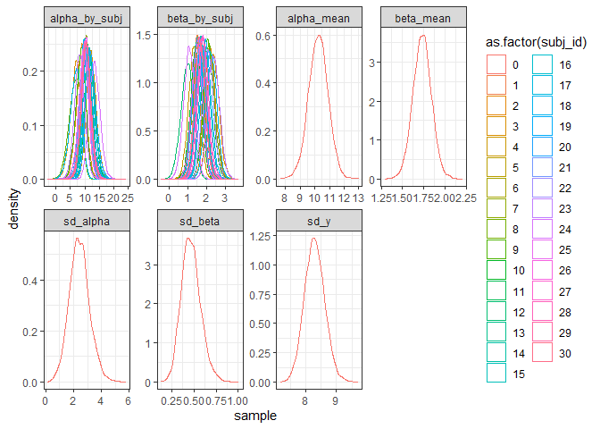<!-- -->

```r
# Quantile function with updated probs
# https://www.tidyverse.org/blog/2023/02/dplyr-1-1-0-pick-reframe-arrange/
quantile_df <- function(x, probs = c(0.025, 0.5, 0.975)) {
  tibble(
    value = quantile(x, probs, na.rm = TRUE),
    prob = probs
  )
}

# ALPHA PARAMETER
# 
# plot(x = true_linear$beta,
#      y = colMeans(par$beta_by_subj)
#      )

df_alpha_quantiles <- df_long %>%
                        filter(parameter == 'alpha_by_subj') %>%
                        reframe(quantile_df(sample), .by = subj_id) %>%
                        pivot_wider(id_cols = c(subj_id),
                                    names_from = prob,
                                    values_from = value)

names(df_alpha_quantiles) <- c('subj_id', 'low', 'median', 'high')

ggplot(data = df_alpha_quantiles,
       mapping = aes(y = median,
                     ymin = low,
                     ymax = high,
                     colour = as.factor(subj_id))
       ) +
    geom_point(aes(x = true_multi_normal$alpha,
                   y = true_multi_normal$alpha)) +
    geom_errorbar(aes(x = true_multi_normal$alpha),
                  width=.2) +
    theme_bw()
```

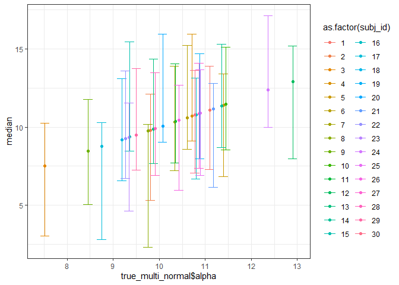<!-- -->

```r
# BETA PARAMETER
df_beta_quantiles <- df_long %>%
                        filter(parameter == 'beta_by_subj') %>%
                        reframe(quantile_df(sample), .by = subj_id) %>%
                        pivot_wider(id_cols = c(subj_id),
                                    names_from = prob,
                                    values_from = value)

names(df_beta_quantiles) <- c('subj_id', 'low', 'median', 'high')

ggplot(data = df_beta_quantiles,
       mapping = aes(y = median,
                     ymin = low,
                     ymax = high,
                     colour = as.factor(subj_id))
       ) +
    geom_point(aes(x = true_multi_normal$beta,
                   y = true_multi_normal$beta)) +
    geom_errorbar(aes(x = true_multi_normal$beta),
                  width=.1) +
    theme_bw()
```

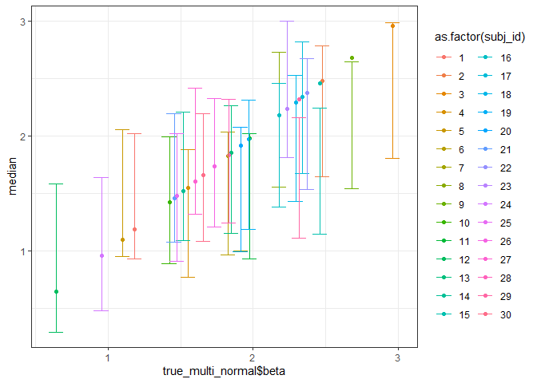<!-- -->

```r
# CORRELATION!
ggplot(data = df_alpha_quantiles,
       mapping = aes(y = median,
                     ymin = low,
                     ymax = high,
                     colour = as.factor(subj_id))
       ) +
    geom_point(aes(x = df_beta_quantiles$median)) +
    theme_bw()
```

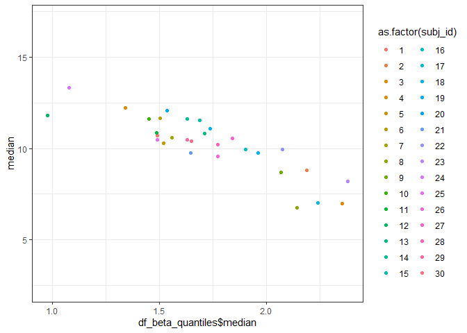<!-- -->

```r
cor(df_alpha_quantiles$median,
    df_beta_quantiles$median)
```

```
## [1] -0.8675409
```

```r
estimated_Omega <- rstan::extract(multi_normal_linear_fit, par = c('Sigma', 'L', 'Omega'))

str(estimated_Omega$Omega)
```

```
##  num [1:8000, 1:2, 1:2] 1 1 1 1 1 1 1 1 1 1 ...
##  - attr(*, "dimnames")=List of 3
##   ..$ iterations: NULL
##   ..$           : NULL
##   ..$           : NULL
```

```r
str(estimated_Omega$L)
```

```
##  num [1:8000, 1:2, 1:2] 1.71 1.91 3.32 2.73 2.99 ...
##  - attr(*, "dimnames")=List of 3
##   ..$ iterations: NULL
##   ..$           : NULL
##   ..$           : NULL
```

Modelling data in a hierarchical structure.
Modelling data in multivariate normal hierarchical model


## Including Plots

You can also embed plots, for example:

<!-- -->

Note that the `echo = FALSE` parameter was added to the code chunk to prevent printing of the R code that generated the plot.
