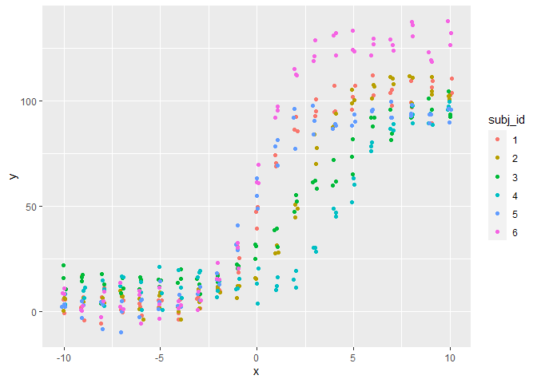

## Multivariate normal hierarchical models

Modelling data.

We will construct some data for our first example using the rnorm function,
which draws random samples from a normal distribution with location (mean) and
scale (sd = standard deviation). Note that we need many draws to be able to 
observe the normal distribution visually.


```r
data <- data.frame(X = rnorm(10, 0, 1),
                   L = rnorm(50, 0, 1),
                   C = rnorm(100, 0, 1),
                   M = rnorm(1000, 0, 1)
                   )

data_long <- data %>%
    pivot_longer(cols = everything(),
                 names_to = 'parameter',
                 values_to = 'value')

data_long$parameter <- factor(x = data_long$parameter,
                              levels = c('X', 'L', 'C', 'M')
                              )

ggplot(data = data_long,
       mapping = aes(x = value)
       ) +
    facet_wrap(~ parameter,
               scales = 'free') +
    geom_histogram() +
    # geom_function(fun = dnorm, colour = "red") +
    theme_bw()
```

```
## `stat_bin()` using `bins = 30`. Pick better value with `binwidth`.
```

<!-- -->

```r
# Should be able to add the actual density but not sure how to split
# by facets
# geom_function(fun = dnorm, colour = "red")
```

If we sample from four different values with appropriate distributions, we can use
the values to simulate data from a sigmoid relationship.


```r
# samples to draw from each distribution
N <- 20

true_parameters <- data.frame(
        subj_id = 1:N,
        alpha = rnorm(N, 100, 10),
        beta = rnorm(N, 1, 0.2),
        gamma = rnorm(N, 2, 1),
        delta = rnorm(N, 10, 5)
        )

true_parameters_long <- true_parameters %>%
    pivot_longer(cols = !subj_id,
                 names_to = 'parameter',
                 values_to = 'value')

true_parameters_long$parameter <- factor(x = true_parameters_long$parameter,
                              levels = c('alpha', 'beta', 'gamma', 'delta')
                              )

four_PL <- function(alpha, beta, gamma, delta, x) {
        delta + (alpha - delta) / (1 + exp(- beta * x + gamma))
}

# There is a trick here somewhere to plot all graphs in one
ggplot(data = true_parameters_long,
       mapping = aes(x = value)
       ) +
    facet_wrap(~ parameter,
               scales = 'free') +
    geom_histogram() +
    theme_bw()
```

```
## `stat_bin()` using `bins = 30`. Pick better value with `binwidth`.
```

<!-- -->

```r
# Set up a palette
my_palette <- viridis::viridis(n = N)

# Set up canvas
plot <- ggplot() +
        xlim(-10, 10) +
        theme_bw()

# Add the individual curves    
for (n in 1:N) {
    plot <- plot +
    geom_function(fun = four_PL,
                  args = list(alpha = true_parameters$alpha[n],
                              beta = true_parameters$beta[n],
                              gamma = true_parameters$gamma[n],
                              delta = true_parameters$delta[n]
                              ),
                  colour = my_palette[n]
                  )        
}

plot
```

<!-- -->


```r
# We now know how to draw perfect data - but we want noisy data!
# Let's add some noise and collect data in replicates at various x values

n_rep <- 3
x_series <- seq(from = -10, to = 10, by = 1)

normal_data <- data.frame(
    subj_id = gl(n = N, k = n_rep * length(x_series)),
    rep = rep(x = 1:n_rep,
              times = N * length(x_series)),
    x = rep(x = sort(rep(x_series, n_rep)),
            times = N),
    y = NA
)

# In this (simplistic) case we will have a common noise level on all data
sd_y <- 5

normal_data$y <- four_PL(alpha = true_parameters$alpha[normal_data$subj_id],
                         beta = true_parameters$beta[normal_data$subj_id],
                         gamma = true_parameters$gamma[normal_data$subj_id],
                         delta = true_parameters$delta[normal_data$subj_id],
                         x = normal_data$x) +
                 rnorm(n = length(normal_data$y),
                       mean = 0,
                       sd = sd_y)

ggplot(data = filter(normal_data, subj_id %in% c(1, 2, 3, 4, 5, 6)),
       mapping = aes(x = x,
                     y = y,
                     colour = subj_id)) +
    geom_jitter(width = 0.1)
```

<!-- -->

Et voilà! Here comes the question - can we model this in Stan?

Modelling data in a hierarchical structure.
Modelling data in multivariate normal hierarchical model


## Including Plots

You can also embed plots, for example:

<!-- -->

Note that the `echo = FALSE` parameter was added to the code chunk to prevent printing of the R code that generated the plot.
